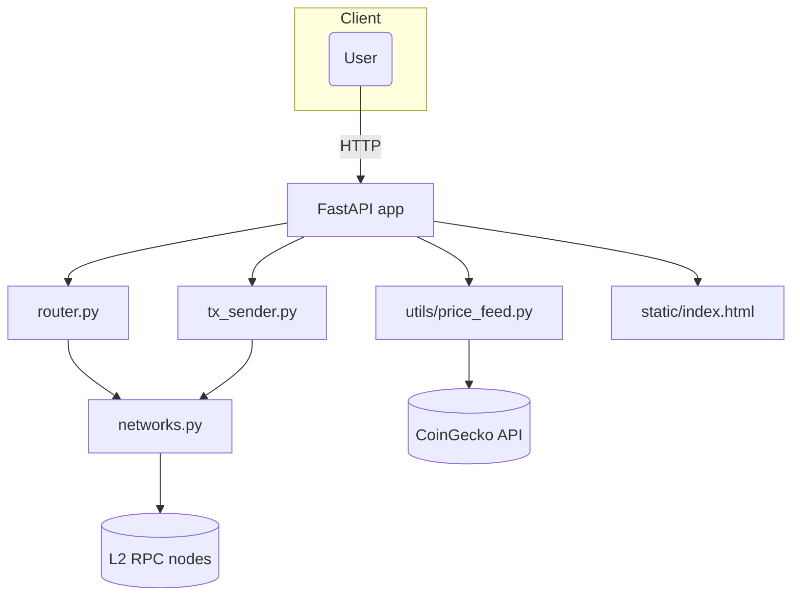

# L2 Router Bot

L2 Router Bot is a self‑hosted service that compares gas fees across multiple Ethereum Layer‑2 networks and automatically routes your Ether transfers to the cheapest (or fastest) chain. It’s built with Python 3.10+, FastAPI and Web3.py and designed to be easy to deploy and extend.

## Features

- 🔗 **Multi-network support** – Arbitrum One, Optimism and Base are supported out of the box. Additional networks can be added via `networks.py`.
- 💾 **Fee estimation** – Calculates gas price, estimated gas usage and total fees in native tokens. Optionally fetches USD estimates via CoinGecko.
- 🚣️ **Route selection** – Compares networks and selects the cheapest (or fastest) option. Networks that fail estimation are skipped.
- 📤 **Transaction broadcasting** – Builds, signs and broadcasts transactions using a private key loaded from environment variables.
- ⚙️ **FastAPI backend** – Provides REST endpoints for networks, estimation, routing and sending.
- 💻 **Optional dashboard** – Includes a static HTML dashboard for quick manual estimation and routing.

## Architecture



FastAPI serves as the entrypoint. `router.py` contains the gas comparison logic. `tx_sender.py` builds and sends signed transactions. Network configurations and RPC clients live in `networks.py`. The optional price feed uses CoinGecko to provide USD estimates.

## Installation

1. Clone the repository:

```bash
git clone https://github.com/karthikeyanvcb/l2-router-bot.git
cd l2-router-bot
```

2. Create and activate a virtual environment:

```bash
python3 -m venv venv
source venv/bin/activate
```

3. Install dependencies:

```bash
pip install -r requirements.txt
```

4. Create a `.env` file based on `.env.example` and fill in your own values:

```bash
cp .env.example .env
# then edit .env to add your PRIVATE_KEY and RPC URLs
```

## Running the Server

Use Uvicorn to run the FastAPI application:

```bash
uvicorn l2_router_bot.main:app --reload
```

The API will be available at `http://localhost:8000`. The optional dashboard can be accessed at the root path.

### Docker (Optional)

You can also run the service using Docker:

```bash
docker build -t l2-router-bot .
docker run --env-file .env -p 8000:8000 l2-router-bot
```

## API Endpoints

| Endpoint | Method | Description |
|---------|--------|-------------|
| `/networks` | GET | List configured networks and their chain IDs. |
| `/estimate` | POST | Estimate gas cost for a transfer across all networks. |
| `/route` | POST | Determine the cheapest network for a given transfer. |
| `/send` | POST | Send a signed transaction on a specified network. |
| `/route-and-send` | POST | Estimate, choose the cheapest network and immediately send the transfer. |

### Example: Estimate Fees

```bash
curl -X POST http://localhost:8000/estimate \
  -H "Content-Type: application/json" \
  -d '{
    "from_address": "0xYourAddress",
    "to_address": "0xRecipientAddress",
    "amount_eth": 0.01,
    "include_usd": true
  }'
```

### Example: Route and Send

```bash
curl -X POST http://localhost:8000/route-and-send \
  -H "Content-Type: application/json" \
  -d '{
    "from_address": "0xYourAddress",
    "to_address": "0xRecipientAddress",
    "amount_eth": 0.01,
    "include_usd": true
  }'
```

The response will include the chosen network and the transaction hash if broadcasting is successful.

## Environment Variables

All sensitive data (private key, RPC URLs) must be provided through environment variables. See `.env.example` for required values.

## Testing

This repository includes a basic test suite using Pytest. To run the tests:

```bash
pip install -r requirements.txt
pytest
```

Some tests may require mocking RPC calls; ensure that environment variables are set accordingly.

## Disclaimer

**Use this software at your own risk.** Sending transactions on Ethereum is irreversible and may result in the loss of funds if misconfigured. Do not commit your private keys to version control and always test in a safe environment.

## Contributing

Contributions are welcome! Please open an issue or submit a pull request for enhancements or bug fixes.
